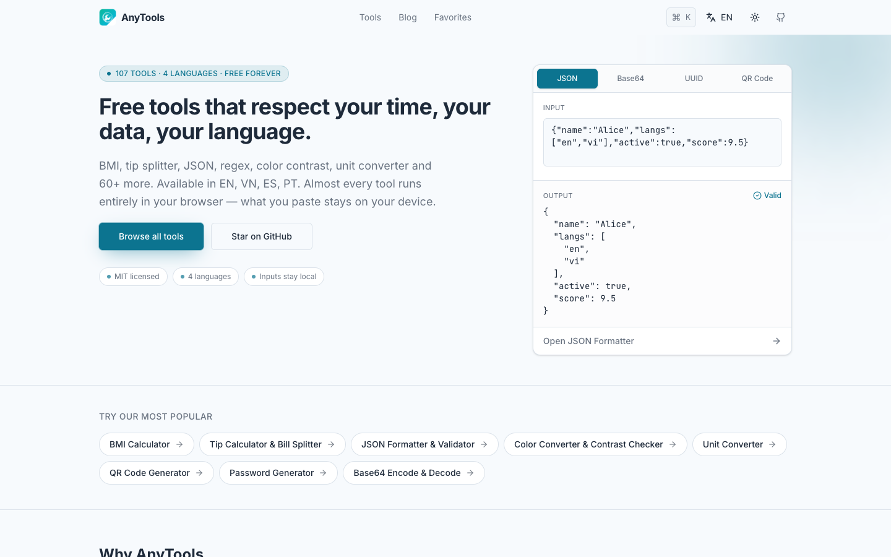
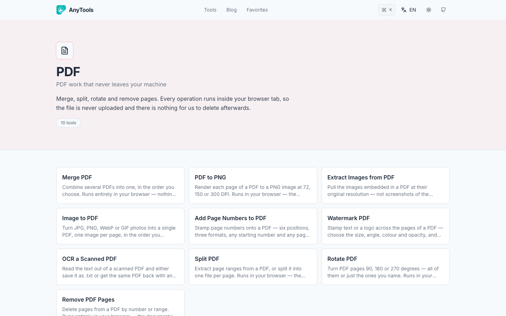
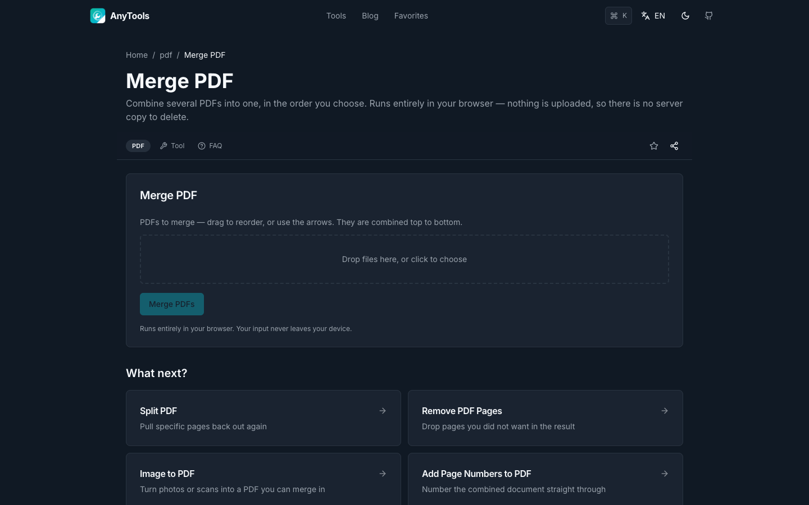

<p align="center">
  <picture>
    <source media="(prefers-color-scheme: dark)" srcset=".github/readme/home-dark.png">
    
  </picture>
</p>

# AnyTools

107 browser-based calculators, converters and developer tools, MIT-licensed and
self-hostable in one command — [anytools.world](https://anytools.world).

```bash
docker run -p 3000:3000 ghcr.io/d0bby999/anytools:v1.0.0
```

Or with Compose:

```yaml
# docker-compose.yml
services:
  anytools:
    image: ghcr.io/d0bby999/anytools:v1.0.0
    container_name: anytools
    ports: ["3000:3000"]
    restart: unless-stopped
    healthcheck:
      test: ["CMD", "wget", "-qO-", "http://127.0.0.1:3000/api/health"]
      interval: 30s
      timeout: 5s
      retries: 3
      start_period: 20s
```

No environment variables, no volume, no signup. Full guide: [`docs/self-hosting.md`](docs/self-hosting.md).

Almost every tool runs entirely in your browser: what you paste stays on your device.
Two exceptions are documented in the section below — they are not the same kind of
exception, and one of them matters if you paste secrets.

## 107 tools across 13 clusters

Counted straight from the registry (`packages/anytools-tools/src/*/meta.ts`), not from
memory:

```bash
grep -rho "cluster: '[a-z0-9-]*'" packages/anytools-tools/src/*/meta.ts | sort | uniq -c | sort -rn
```

| Cluster | Tools | | Cluster | Tools |
|---|---:|---|---|---:|
| Lifestyle | 16 | | Image | 7 |
| Converters | 12 | | Health | 7 |
| PDF | 10 | | Design | 7 |
| Generators | 10 | | Text & regex | 6 |
| Finance | 9 | | Time & date | 4 |
| Encoding | 9 | | Web3 | 2 |
| Formatters | 8 | | **Total** | **107** |

<p align="center">
  
</p>

## What leaves the browser

Two things touch the network here, and they are not the same kind of thing — don't
read this as "2 tools call out":

1. **Currency converter** calls `/api/fx`, which calls out to the internet —
   [Frankfurter](https://api.frankfurter.app) (ECB reference rates, no API key). This
   is the only third-party egress in the whole app.
2. **curl → code converter** calls `/api/curl-convert`, which does **not** call out to
   the internet. But the curl command you paste — which **often contains an
   `Authorization: Bearer …` header** — is POSTed verbatim to the server you are
   running (`api/curl-convert/route.ts:29-43`), because the underlying parser
   (`tree-sitter`) needs a native binding that cannot run in a browser. On the hosted
   instance at anytools.world, that server is ours. If you self-host, that server is
   yours, and nobody else's.

We're stating this plainly because "nothing leaves your device" is the first thing
Hacker News will check, and it deserves a straight answer instead of a hand-wave.

<p align="center">
  
</p>

## How it compares

Facts and links verified 2026-09-03 — numbers on GitHub-hosted projects move, check
the linked source before quoting these elsewhere.

| | AnyTools | it-tools | omni-tools | Stirling-PDF |
|---|---|---|---|---|
| Licence | MIT ([`LICENSE`](LICENSE)) | **GPL-3.0** ([source](https://github.com/CorentinTh/it-tools/blob/main/LICENSE)) | MIT ([source](https://github.com/iib0011/omni-tools/blob/main/LICENSE)) | open-core: MIT + a `proprietary` folder ([source](https://raw.githubusercontent.com/Stirling-Tools/Stirling-PDF/main/LICENSE)) |
| GitHub stars (2026-09-03) | 0 | 40,448 | 10,126 | 91,208 |
| Tools | 107 (counted from `meta-registry.ts`, see above) | 86 folders under `src/tools` | not published; organized into 12 groups | "50+ PDF tools" (per its own README) |
| Scope | dev + PDF + image + **finance/health/lifestyle** | dev/IT tools only | audio, converters, csv, image, json, list, number, pdf, string, time, video, xml | PDF only |
| Where it runs | in the browser (2 exceptions, see above) | in the browser | in the browser | **server-side** (Java) |
| UI languages | 4 (en, vi, es, pt) | 9 locales (de, en, es, fr, no, pt, uk, vi, zh) | not published | "40+ languages" (per its own README) |

AnyTools' image ships offline WASM runtimes for the file tools (pdf.js, tesseract.js,
an ONNX background-removal model, libheif, libarchive) so those tools work without a
CDN call — that's a deliberate size-for-privacy trade, not a free lunch; see the
"Third-party runtime assets" section of [`docs/deployment-guide.md`](docs/deployment-guide.md)
for the real numbers instead of a guess.

## Self-hosting

```bash
docker run -p 3000:3000 ghcr.io/d0bby999/anytools:v1.0.0
```

| Variable | When | Required | Default |
|---|---|---|---|
| `PORT` | runtime | no | `3000` |
| `OXR_APP_ID` | runtime | no | unset (falls back to Frankfurter) |
| `NEXT_PUBLIC_SELF_HOSTED` | **build-time only** | — | — |

That's the entire runtime env surface — two optional variables. `NEXT_PUBLIC_*`
values are inlined into the page HTML at `next build` time (the whole locale tree is
statically prerendered), so they cannot be changed with `docker run -e` after the
image is built; they only matter if you build your own image, covered in the
"Building your own image" section of [`docs/self-hosting.md`](docs/self-hosting.md).

The self-host image has no ads, no analytics, no accounts, no database volume, emits
no absolute URLs (no canonical tag, no sitemap, no `llms.txt`) and no social-preview
metadata (`og:image`, `twitter:image`, structured data). Full list of what's disabled
and why → [`docs/self-hosting.md`](docs/self-hosting.md).

## Licence and third-party notices

MIT — see [`LICENSE`](LICENSE). Bundled dependencies (including the LGPL-3.0
obligations for `libheif-js`, used for HEIC/HEIF decoding) are listed with full notice
text in [`THIRD-PARTY-NOTICES.md`](THIRD-PARTY-NOTICES.md).

[Issues and feature requests](https://github.com/D0bby999/anytools/issues) are welcome,
self-hosting problems included.

## Layout

```
apps/anytools-web            Next.js 15 app (App Router, next-intl, 4 locales)
packages/anytools-tools      the 107 tools: pure logic + UI, one directory each
packages/ui                  shared components and the design tokens
packages/anytools-i18n       locale list and helpers
packages/anytools-analytics  Umami event wrapper
packages/db-shared           Postgres client for the DB-backed blog
packages/postclaw-blog-endpoint  blog ingest endpoint
packages/config              shared tsconfig/biome presets
```

Each tool is a folder with `logic.ts` (pure, testable), `ui.tsx`, `meta.ts` and `logic.test.ts`.
Adding a tool means adding that folder and registering it in `meta-registry.ts`; the catalogue,
sitemap, cluster pages and search pick it up from there.

## Working on it

```bash
pnpm install
pnpm dev          # anytools-web on :3000
pnpm typecheck    # every workspace package
pnpm -r test      # 1519 tests
pnpm build
```

Tool copy lives in `apps/anytools-web/content/<locale>/tools/<cluster>/<slug>-faq.mdx`
(and `-tutorial.mdx`). The FAQ block is both the page body and the FAQPage structured data,
so a tool without one ships a page with nothing on it but a widget.

`packages/anytools-tools/src/reference-values.test.ts` cross-checks the numbers the FAQ copy
states out loud against the implementations, using values derived independently from the
published formulas. If a formula changes, or the copy drifts from it, that suite fails.

## History

Extracted from the `dobby-platform` monorepo, which also holds two affiliate content sites.
The commits touching AnyTools came across with it, so `git log` reaches back to May 2026.
